# **Capítulo I: Introducción**
## **1.1. Startup Profile**
### **1.1.1. Descripción de la Startup**

Los Arquitectos es una startup de desarrollo de software que otorga, mediante el uso de deep learning y visión artificial, la facilidad de que nuevas personas puedan adentrarse al mundo fitness teniendo la seguridad de que la aplicación los ayudará a supervisar en vivo sus rutinas de ejercicio.

**Misión**

Facilitar rutinas de ejercicios a personas que comienzan a adentrarse al mundo fitness y supervisar sus rutinas de ejercicios mediante el uso de visión artificial y deep learning.

**Visión**

Ser una startup reconocida a nivel nacional y la primera opción de nuevos personas que ingresan por primera vez al mundo fitness.

### **1.1.2. Perfiles de integrantes del equipo**

**Nombre:** Vanessa Irene Flores Ñahuis

**Carrera:** Ingeniería de software

**Descripción:** Soy estudiante de la carrera de ingeniería de software en la Universidad Peruana de Ciencias Aplicadas. Me considero una persona dispuesta a aprender nuevas habilidades y aportaré al equipo y al desarrollo del trabajo con los conocimientos que he adquirido en cursos previos y los conocimientos que adquiriré en este curso.

**Nombre:** Adrian Fernando Liviapoma Mendez

**Carrera:** Ingeniería de software

**Descripción:** Soy estudiante de la carrera de Ingeniería de Software, considero que este proyecto me ayudara a desenvolverme como mejor profesional en el ámbito laboral y a mejorar los conocimientos previos.

**Nombre:** José Sebastián Chacón Córdova

**Carrera:** Ingeniería de software

**Descripción:** Soy estudiante de la carrera de Ingeniería de Software, actualmente curso el 8vo ciclo. Tengo conocimiento en diversos lenguajes de programación tales como python, C, java y Dart y considero que estos podrán ser de utilidad en el desarrollo de este curso.

**Nombre:** Victor Fajardo Rojas

**Carrera:** Ingeniería de software

**Descripción:** Soy programador full stack interesado en desarrollo desktop y web con gran interés en la aplicación de nuevas tecnologías como solución a problemas actuales.

**Nombre:** Gerardo Gabriel Caldas Díaz

**Carrera:** Ingeniería de software

**Descripción:** Me encuentro estudiando la carrera de Ingeniería de Software, cursando el octavo ciclo junto con noveno. Este proyecto que me encuentro realizando junto a mis compañeros de clases me va a ayudar mucho a desenvolverme en mi vida laboral ya qué estoy adquiriendo nuevos conocimientos.

## **1.2. Solution Profile**
EzGym es una innovadora startup que ha revolucionado la forma en que las personas mejoran su salud y bienestar a través del ejercicio. Nuestra aplicación utiliza tecnologías de vanguardia en aprendizaje profundo (Deep Learning) y Visión artificial (Computer Vision) para verificar la correcta ejecución de rutinas de ejercicio, proporcionando a los usuarios una experiencia de entrenamiento personalizada y efectiva como nunca antes.
### **1.2.1 Antecedentes y problemática**
Las personas nuevas en el gimnasio a menudo se enfrentan a varios desafíos. La sobrecarga es común, ya que algunos intentan hacer demasiado ejercicio demasiado pronto, lo que puede llevar al agotamiento o incluso al sobreentrenamiento. Además, el dolor muscular, conocido como DOMS, puede aparecer después de un nuevo entrenamiento, desmotivando a algunas personas y haciéndolas sentir incómodas. Otro obstáculo importante es la falta de conocimiento sobre cómo diseñar un programa de ejercicios efectivo y equilibrado, lo que puede llevar a resultados insatisfactorios. Para superar estos desafíos, es esencial comenzar de manera gradual, ejecutarlo de forma correcta, aprender sobre el entrenamiento adecuado y escuchar al cuerpo para evitar lesiones y mantener la motivación a largo plazo.
Por este motivo, la solución planteada busca ayudar a las personas en este nuevo mundo en el que se adentran.

### **1.2.2 Lean UX Process**

#### **1.2.2.1. Lean UX Problem Statements**

**Cliente:**

Nuestro servicio busca cubrir la necesidad de las personas nuevas en el mundo del fitness, en términos de rutinas y su correcta ejecución, al proporcionar una solución integral y personalizada. Comprendemos que el ingreso al gimnasio puede ser abrumador y desafiante para aquellos sin experiencia previa. Por lo tanto, hemos diseñado un enfoque que no solo se centra en proporcionar rutinas de ejercicio efectivas, sino que también aborda la preocupación fundamental de cómo realizar los movimientos de manera segura y eficiente.

Por lo que. ¿Cómo podemos ayudar a los principiantes a ejecutar los ejercicios y a la vez resguardar su seguridad?

Nuestro servicio busca cubrir la necesidad de las personas nuevas en el mundo del fitness, en términos de rutinas y su correcta ejecución, al proporcionar una solución integral y personalizada. Comprendemos que el ingreso al gimnasio puede ser abrumador y desafiante para aquellos sin experiencia previa. Por lo tanto, hemos diseñado un enfoque que no solo se centra en proporcionar rutinas de ejercicio efectivas, sino que también aborda la preocupación fundamental de cómo realizar los movimientos de manera segura y eficiente.

Por lo que. ¿Cómo podemos ayudar a los principiantes a ejecutar los ejercicios y a la vez resguardar su seguridad?

#### **1.2.2.2. Lean UX Assumptions**

- Nuestros clientes necesitan una aplicación que les permita verificar la correcta ejecución de las rutinas que realizan para reducir la probabilidad de lesiones y mejorar su rendimiento en el gimnasio.
- Tenemos un público objetivo: Aquella persona que viene iniciando en el gimnasio 
- La propuesta por el grupo cuenta con una aplicación interactiva e intuitiva la cual brindara el feedback necesario para que el usuario pueda realizar la correcta ejecución de los ejercicios.

**Business Outcomes**
- Mejora la calidad del ejercicio realizado
- Reduce el dolor muscular
- Reduce la probabilidad de lesiones
- Mejora el rendimiento de los usuarios en el gimnasio 

**Users**
- User Principal: Persona que inicia en el mundo del fitness y realiza ejercicios en el gimnasio

**User Outcomes**
- Los usuarios mejoran su rendimiento en el gimnasio gracias a los consejos brindados por la aplicación. 
- Los usuarios no tendrán problemas al utilizar la aplicación ya que esta será sencilla e intuitiva de utilizar.
- Los usuarios reducirán la probabilidad de contraer lesiones gracias a las guías brindadas por la aplicación. 

**Features**
- Función que permitirá seleccionar una de las rutinas predeterminadas de la aplicación
- Función que te brindara guías para la correcta ejecución de los ejercicios
- Función que te notificara en caso no estes realizando los ejercicios de manera correcta

#### **1.2.2.3. Lean UX Hypothesis Statements**

**Hypothesis: (1)**

*Creemos que*
Al brindar una aplicación que permita brindar acompañamiento y consejos durante la ejecución de los ejercicios para que estos puedan ser realizados de manera correcta, los usuarios mejoran su rendimiento en el gimnasio. 

*Sabremos que hemos tenido éxito*
Cuando aumente la cantidad de usuarios que utilicen la aplicación.

**Hypothesis: (2)**

*Creemos que*
Al ofrecer notificaciones cuando los usuarios no realicen los ejercicios de manera correcta, reduciremos la probabilidad de que estos puedan llegar a lesionarse.

*Sabremos que hemos tenido éxito*
Cuando las reseñas de nuestros usuarios sean en su mayoría extremadamente positivas.

#### **1.2.2.4. Lean UX Canvas**

## **1.3. Segmentos objetivo**

Los usuarios de nuestra aplicación están conformados por un tipo de perfil. a continuacion se dara detalle:

- **Cliente nuevo:** Persona mayor de 18 años que recién está adentrándose al mundo fitness y tiene la necesidad de que supervisen sus rutinas de ejercicio.

# **Capítulo II: Requirements Elicitation & Analysis**
## **2.1. Competidores**

Para el desarrollo de este proyecto consideramos 3 posibles competidores de los cuales  los dos primeros son cadenas de gimnasios bastante conocidas en Perú (SmartFit y BodyTech) y el último es una aplicación móvil bastante usada por deportistas que acuden al gimnasio la cual brinda apoyo para trackear los respectivos entrenamientos.

### **2.1.1. Análisis competitivo**

<table>
    <tbody>
        <tr>           
            <th colspan=6>Competitive Analysis Landscape</th>
        </tr>
        <tr>           
            <th colspan=6>El análisis realizado fue con el fin de analizar y desarrollar las posibles estrategias de mercado frente a los competidores directos e indirectos. El análisis realizado fue con el fin de analizar y desarrollar las posibles estrategias de mercado frente a los competidores directos e indirectos.</th>
        </tr>
        <tr>           
            <th colspan=6>¿Cómo podemos diferenciarnos de las otras empresas presentes en el mercado del rubro fitness?</th>
        </tr>
        <tr>
            <td colspan=2>" "</td>
            <td align="center">SmartFit</td>
            <td align="center">BodyTech</td>
            <td align="center">RepCount</td>
            <td align="center">EzGym</td>
        </tr>
        <tr>
            <td>Perfil</td>
            <td align="center">Overview</td>
            <td align="center">Cadena de gimnasios que cuenta con precios bastante competitivos y una aplicación para complementar el entrenamiento</td>
            <td>Cadena de gimnasios “premium” que cuenta con aplicación para complementar el entrenamiento</td>
            <td align="center">Aplicación que permite generar rutinas y trackear los respectivos entrenamientos</td>
            <td align="center">Aplicación que permite elegir ciertas rutinas predeterminadas y contar con una guia para realizar los ejercicios de manera correcta gracias a el uso de machine learning</td>
        </tr>
        <tr>
            <td>" "</td>
            <td align="center">Ventaja competitiva ¿Qué valor ofrece a los clientes?</td>
            <td align="center">Gran cantidad de sucursales a nivel nacional e internacional</td>
            <td>Uso de maquinarias y herramientas de mayor calidad</td>
            <td align="center">Uso de aplicacion movil para trackear entrenamientos</td>
            <td align="center">Uso de machine learning para complementar el entrenamiento</td>
        </tr>
        <tr>
            <td rowspan=2>Perfil de Marketing</td>
            <td>Mercado objetivo</td>
            <td>Deportistas principiantes</td>
            <td>Deportistas avanzados </td>
            <td>Deportistas avanzados</td>
            <td>Deportistas principiantes</td>
        </tr>
        <tr>
            <td>Estrategias de marketing</td>
            <td>Ofrecen diversas ofertas para suscripción a sus planes</td>
            <td>Ofrecen diversas ofertas para suscripción a sus planes.</td>
            <td>Se enfocan en los deportistas avanzados quienes recomiendan la aplicación</td>
            <td>Enfocarse en los deportistas principiantes los cuales son nuestro mercado objetivo.</td>
        </tr>
        <tr>
            <td rowspan=3>Perfil del producto</td>
            <td>Productos & Servicios</td>
            <td>Suscripción a gimnasios</td>
            <td>Suscripción a gimnasios</td>
            <td>Aplicación que permite trackear entrenamiento</td>
            <td>Aplicación que brinda  apoyo durante el entrenamiento</td>
        </tr>
        <tr>
            <td>Precios y Costos</td>
            <td>Precios dependiendo de la suscripción que elijas (Black o Smart)</td>
            <td>Precios en base a la cantidad de meses de la suscripción</td>
            <td>Acceso premium que desbloquea nuevas funcionalidades</td>
            <td>Acceso premium desbloquea nuevas funcionalidades</td>
        </tr>
        <tr>
            <td>Canales de distribución (Web y/o móvil)</td>
            <td>Plataforma Web, Presencial</td>
            <td>Plataforma Web, Presencial</td>
            <td>App Móvil</td>
            <td>Plataforma web</td>
        </tr>
        <tr>
            <td rowspan=4>Análisis SWOT</td>
            <td>Fortalezas</td>
            <td>Amplia cantidad de sucursales en Lima y provincias</td>
            <td>Gimnasio considerado por muchos como premium</td>
            <td>Amplia configurabilidad de los entrenamientos según las necesidad del usuario</td>
            <td>Uso de machine learning para la correcta ejecución de los ejercicios</td>
        </tr>
        <tr>
            <td>Debilidades</td>
            <td>No cuentan con la mejor maquinaria del mercado</td>
            <td>Cuentan con precios más elevados con respecto a sus competidores</td>
            <td>Complicada de usar para un usuario principiante</td>
            <td>No es de mucha utilidad para un usuario avanzado</td>
        </tr>
        <tr>
            <td>Oportunidades</td>
            <td>Mejorar el equipo con el que cuenta los distintos gimnasios</td>
            <td>Brindar mejores ofertas en los planes de suscripción</td>
            <td>Brindar rutinas predeterminadas para usuarios principiantes</td>
            <td>Brindar una amplia variedad de rutinas</td>
        </tr>
        <tr>
            <td>Amenazas</td>
            <td>Competidores que ofrecen mejores equipos.</td>
            <td>Competidores que ofrecen precios menores</td>
            <td>Competidores que ofrecen plataformas más intuitivas</td>
            <td>Competidores que ofrecen mayor  variedad de entrenamientos y configuración</td>
        </tr>
    </tbody>
</table>

### **2.1.2. Estrategias y tácticas frente a competidores**

## **2.2. Entrevistas**
 Como parte del análisis needfinding del proyecto, un paso importante que hay que seguir es la realización de entrevistas a los segmentos objetivos para la captación de necesidades y oportunidad de enfatizar con ellos en busca de la creación de la mejor solución software. A continuación, se presenta la lista de preguntas a realizar a nuestros usuarios

### **2.2.1. Diseño de entrevistas**
**1. Bienvenida**
Hola buenas (días/tardes/noches), estoy trabajando en una idea de negocio que pretende ayudar a mejorar la experiencia al ejecutar la rutina de ejercicios en el gym. Si te parece comenzaré con algunas preguntas a continuación y al finalizar te cuento de qué va el proyecto.

**2. Datos demográficos**
¿Podrías contarnos un poco más de ti? (Un poco de tu historia, quien eres, tu edad, dónde vives, estudios, si es que trabajas actualmente, responsabilidades cotidianas, hobbies, etc.)

**3. Principales problemas**
* ¿Qué te motivó a unirte a un gimnasio y comenzar un programa de ejercicios?*
* ¿Cuáles eran tus expectativas antes de unirte al gimnasio y cómo han evolucionado desde entonces?
* ¿Qué obstáculos o desafíos has enfrentado desde que comenzaste a hacer ejercicio en el gimnasio?
* ¿Cómo te sientes acerca de la forma en que se te ha proporcionado orientación y apoyo en el gimnasio hasta ahora?
* ¿Has experimentado algún dolor muscular o incomodidad después de tus entrenamientos? ¿Cómo has lidiado con eso?
* ¿Qué tipo de rutinas de ejercicio te resultan más atractivas o efectivas?
* ¿Has tenido dificultades para mantener la motivación y la consistencia en tu rutina de ejercicio? ¿Cómo las superaste?
* ¿Qué aspectos del gimnasio o del proceso de hacer ejercicio te gustaría que fueran diferentes o mejorados?
* ¿Has considerado utilizar aplicaciones o tecnología para ayudarte en tu entrenamiento? ¿Por qué sí o por qué no?
* ¿Cuáles son tus metas a largo plazo en cuanto a fitness y salud? ¿Cómo planeas alcanzarlas?
### **2.2.2. Registro de entrevistas**

**Entrevista 1:** John Silva Kramer

[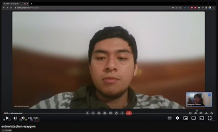](https://www.youtube.com/watch?v=QXPJKtuqNX0)

Jhon es un estudiante de ingeniería de software de 22 años, él comenta que la motivación que tuvo para comenzar a hacer ejercicio fue ganar fuerza y verse bien. También mencionó que durante su trayecto tuvo múltiples obstáculos, ya que al ser nuevo no sabia que rutinas tomar o la forma correcta  de hacer los ejercicios. También comentó que la orientación que le dieron en el gym no era la adecuada, ya que para su gusto era bastante básica. También comenta que usa un app llamada “hevy” para mantener un registro de sus rutinas y avances.

**Link del video:** [John Silva](https://www.youtube.com/watch?v=QXPJKtuqNX0)

**Entrevista 2:** Andrea Liviapoma Mendez

Andrea es una estudiante de la carrera de nutrición de 22 años, ella comenta que sus amigos la motivaron para comenzar a hacer ejercicio en el gimnasio. Menciona  que algunos de los obstáculos que enfrentó fue la gran cantidad de personas que había en el gimnasio en algunos horarios lo que generaba que el ambiente no fuera el adecuado para su entrenamiento disminuyendo así su motivación para entrenar, También menciona que siempre ha tenido buenas experiencias con los entrenadores del gimnasio ya que le brindaron información adecuada y siempre estaban atentos para poderle brindar el apoyo necesario con alguna técnica o la correcta utilización de las máquinas. Por último menciona que  tiene conocimiento de la existencia de aplicaciones que brindan apoyo con los entrenamientos pero que por el momento no utiliza ninguna personalmente sin embargo indica que en un futuro tiene pensado poder utilizar alguna de estas aplicaciones. 

**Link del video:** [Andrea Liviapoma](https://upcedupe-my.sharepoint.com/:v:/g/personal/u20161a096_upc_edu_pe/EV3Ouk87indGizZp4JW7vhcBlKHE8DUffoNF7pcHImSlEA?e=HEJBrm&nav=eyJyZWZlcnJhbEluZm8iOnsicmVmZXJyYWxBcHAiOiJTdHJlYW1XZWJBcHAiLCJyZWZlcnJhbFZpZXciOiJTaGFyZURpYWxvZyIsInJlZmVycmFsQXBwUGxhdGZvcm0iOiJXZWIiLCJyZWZlcnJhbE1vZGUiOiJ2aWV3In19)

**Entrevista 3:** Sergio Flores

Sergio Flores es estudiante de la carrera de Ciencias de la Computación. Sergio comenta que su motivación para unirse a un gimnasio fue mantener su peso y un buen estado físico. En un inicio consideró que sería sencillo hacer ejercicio, sin embargo se dio cuenta que cuando se exige demasiado termina con los músculos lastimados y tiene que descansar antes de continuar con los ejercicios. Hasta el momento, Sergio comenta que ha recibido una buena orientación en el gimnasio. La rutina de ejercicio que prefiere se llama “six pack” y ha podido mantener la motivación y consistencia durante la rutina de ejercicios. Sergio comentó que anteriormente utilizaba una aplicación para sus rutinas en casa, pero que después de ir al gimnasio ya no tuvo la necesidad de usarlo, puesto que ahí contaba con un personal que pudiera ayudarlo. Sergio no cuenta con una meta fija, simplemente desea continuar haciendo ejercicio rutinariamente para mantener su físico sin exigirse demasiado.

**Link del video:** [Sergio Flores](https://youtu.be/BDjTYUqqFgU)

**Entrevista 4:** Patricio Peña
Patricio Alexander Peña Bordon es un joven estudiante de 20 años qué estudia negocios internacionales en la UPN. Es un joven qué se siente muy frustrado al momento de ir al gimnasio ya que siempre lo encuentra lleno y no le permite entrenar de manera adecuada. El tiene como motivación ganar masa muscular y perder peso, además de tener un buen físico para poder correr. A veces se desmotiva al sentir dolores en los músculos por ese motivo le parece interesante una aplicación que le permita realizar los ejercicios y le corrija cuando no lo haga adecuadamente.

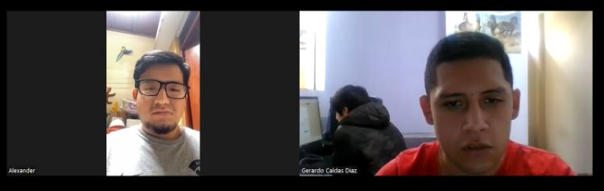

**Link del video:** [Patricio Peña](https://www.youtube.com/watch?v=H_AGGHVv9EE&ab_channel=GerardoCaldas)

**Entrevista 5:** David Sanchez

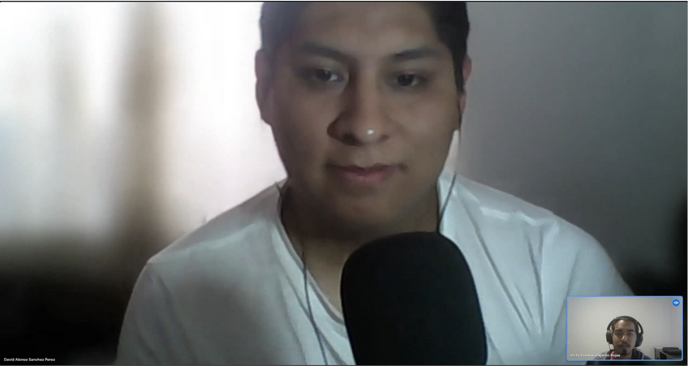

David Alejandro Sanchez Perez es un ingeniero mecatrónico que trabaja en una empresa alemana especializada en automatización industrial. En el pasado ha ido al gimnasio con el objetivo de bajar de peso y mejorar su apariencia, sin embargo encuentra dificultades debido a que se encuentran llenos y no es posible contar con una persona que supervise tu ejercicio o te oriente. Se desmotiva a continuar por ese motivo, junto con el cansancio del trabajo y la falta de cupo a hora punta.

**Link del video:** [David Sanchez](https://youtu.be/O38pngQBN7Q)

### **2.2.3. Análisis de entrevistas**

<table>
    <tbody>
        <tr>
            <td align="center">Preguntas Especificas</td>
            <td align="center">Respuestas del Entrevistado</td>
            <td align="center">Análisis</td>
        </tr>
        <tr>
            <td>1. ¿Cómo te sientes acerca de la forma en que se te ha proporcionado orientación y apoyo en el gimnasio hasta ahora?</td>
            <td>Consideramos que si bien existe un personal que brinda orientación dentro del gimnasio en muchos casos la información que se nos brinda es bastante básica y general.</td>
            <td>El entrevistado demuestra que si bien existe una orientación inicial por parte del personal de los gimnasios a los que acuden esta información es bastante básica y general</td>
        </tr>
        <tr>
            <td>2. ¿Has experimentado algún dolor muscular o incomodidad después de tus entrenamientos? ¿Cómo has lidiado con eso?</td>
            <td>SI hemos presentado dolor muscular pero esto se debe a el inicio en los entrenamientos y el dolor que se genera luego de entrenar.</td>
            <td>El entrevistado comenta que si han presentado dolor muscular pero esto es propio del entrenamiento y usualmente pasa luego de unos dias </td>        
        </tr>
        <tr>
            <td>3. ¿Has tenido dificultades para mantener la motivación y la consistencia en tu rutina de ejercicio? ¿Cómo las superaste?</td>
            <td>.Si presentamos algunas dificultades al principio para mantener la motivación pero gracias a la constancia logramos superar estos inconvenientes</td>
            <td>Los entrevistados mencionan que si contaban con ciertas dificultades al comenzar su viaje fitness pero que gracias a la consistencia pudieron superar la falta de motivación</td>        
        </tr>
        <tr>
            <td>4. ¿Has considerado utilizar aplicaciones o tecnología para ayudarte en tu entrenamiento? ¿Por qué sí o por qué no?</td>
            <td>Por el momento no utilizamos aplicaciones para complementar el entrenamiento pero no dudamos que en un futuro podamos utilizarlas.</td>
            <td>Los entrevistados mencionan que si tienen conocimiento de diversas aplicaciones que brindan apoyo para complementar los entrenamientos pero que por el momento no utilizan ninguna de estas sin embargo no rechazan la posibilidad de utilizar alguna de ellas en un futuro</td>        
        </tr>
        <tr>
            <td>5. ¿Cuáles son tus metas a largo plazo en cuanto a fitness y salud? ¿Cómo planeas alcanzarlas?</td>
            <td>Alguna de las metas que buscamos son aumentar masa muscular, bajar de peso y gracias a esto mejorar nuestra calidad de vida</td>
            <td>El entrevistado demuestra que si bien existe una orientación inicial por parte del personal de los gimnasios a los que acuden esta información es bastante básica y general</td>        
        </tr>
    </tbody>
</table>

## **2.3. Needfinding**
Para poder desarrollar la aplicación es necesario definir un segmento objetivo específico, para lo cual se ha de identificar un user persona, así como las necesidades que este presenta, la forma en cómo se comporta actualmente y realizar una comparación con la forma en como se espera que esto ocurra al usar la aplicación.
### **2.3.1. User Personas**

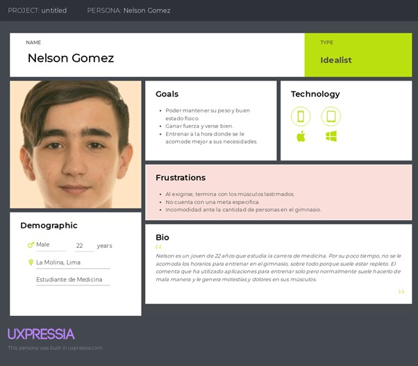

### **2.3.2. User Task Matrix**

<table>
    <thead>
        <tr>
            <th rowspan=2>User Task</th>
            <th colspan=2>Cliente</th>
        </tr>
        <tr>
            <th>Frequency</th>
            <th>Severity</th>
        </tr>
    </thead>
    <tbody>
        <tr>
            <td>Buscar rutinas predeterminadas de ejercicio</td>
            <td align="center">Multiple</td>
            <td align="center">High</td>
        </tr>
        <tr>
            <td>Filtrar rutinas por duración</td>
            <td align="center">Rare</td>
            <td align="center">Medium</td>
        </tr>
        <tr>
            <td>Filtrar rutinas por tipo</td>
            <td align="center">Rare</td>
            <td align="center">Medium</td>
        </tr>
        <tr>
            <td>Activar la supervisión de la ejecución de rutina de ejercicio</td>
            <td align="center">Multiple</td>
            <td align="center">High</td>
        </tr>
        <tr>
            <td>Agregar rutinas de ejercicio a favoritos</td>
            <td align="center">Rare</td>
            <td align="center">Medium</td>
        </tr>
        <tr>
            <td>Visualizar rutinas favoritas</td>
            <td align="center">Rare</td>
            <td align="center">Medium</td>
        </tr>
        <tr>
            <td>Calificar rutinas de ejercicio</td>
            <td align="center">Rare</td>
            <td align="center">Medium</td>
        </tr>
        <tr>
            <td>Visualizar detalles de un ejercicio en específico</td>
            <td align="center">Rare</td>
            <td align="center">Medium</td>
        </tr>
        <tr>
            <td>Adquirir membresía</td>
            <td align="center">Rare</td>
            <td align="center">Medium</td>
        </tr>
    </tbody>
</table>

### **2.3.3. Empathy Mapping**

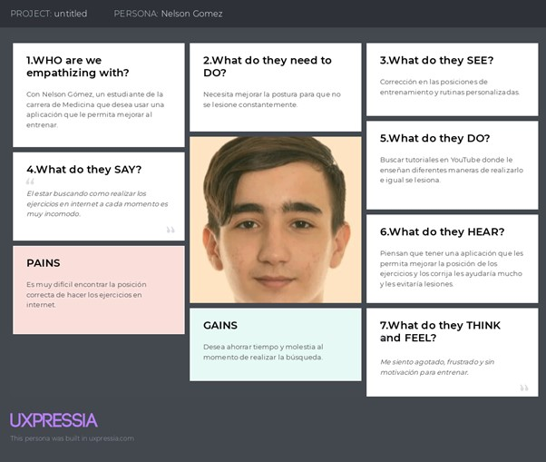

### **2.3.4. As-is Scenario Mapping**

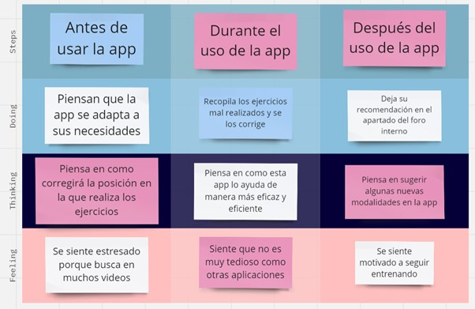

# **Capítulo III: Requirements Specification**

## **3.1. To-Be Scenario Mapping**

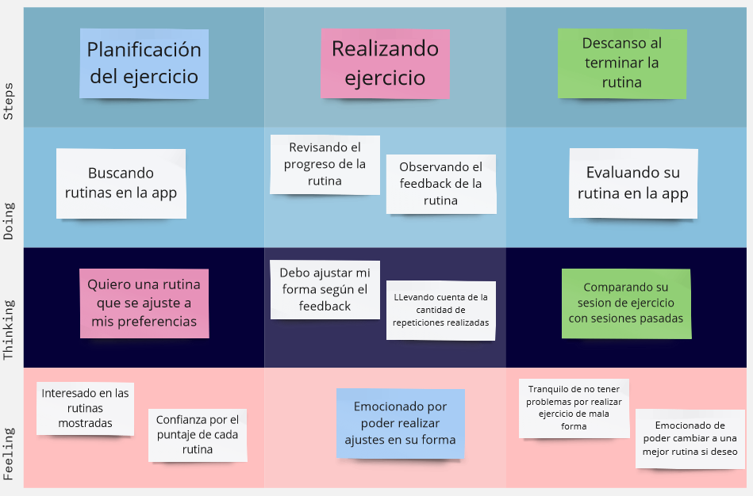

## **3.2. User Stories**

<table>
    <thead>
        <tr>
            <th>User Story ID</th>
            <th>Título</th>
            <th>Descripción</th>
            <th>Criterios de aceptación</th>
        </tr>
    </thead>
    <tbody>
        <tr>
            <td align="center">US01</td>
            <td>Buscar rutinas</td>
            <td>Como cliente quiero buscar rutinas de ejercicios para ejercitarte y mantenerte más saludable</td>
            <td>Escenario 1: Búsqueda de rutinas
             Dado que me encuentro en la sección “Encontrar rutinas” cuando hago clic en la barra de búsqueda, escribe el nombre de la rutina de deseo y hago clic en el ícono de la lupa entonces el sistema muestra todos las rutinas que coincidan con lo especificado.
              Escenario 2: No se encontró ninguna rutina
             Dado que me encuentro en la barra de búsqueda de la sección “Encontrar rutina” cuando introduzco el nombre de una rutina que no coincida con ninguna rutina alojada en la aplicación y hago clic en el ícono de la lupa entonces el sistema muestra el mensaje “No se encontró ninguna rutina”.</td>
        </tr>
        <tr>
            <td align="center">US02</td>
            <td>Filtrar rutinas por duració</td>
            <td>Como cliente quiero filtrar rutinas de ejercicios según su duración para encontrar aquellas rutinas que se adecuen al tiempo que tengo disponible.</td>
            <td>Escenario 1: Búsqueda filtrada según duración
             Dado que me encuentro en la sección “Encontrar rutina” cuando selecciono la duración que deseo y hago clic en el ícono de la lupa entonces el sistema muestra todas las rutinas que coincidan con la duración especificada.
              Escenario 2: Selección de una sola opción
             Dado que me encuentro en la sección “Encontrar rutina” y una opción de duración está seleccionada cuando hago clic en otra opción de duración entonces el sistema mantiene seleccionada solamente la última opción escogida.
              Escenario 3: Especificar duración
             Dado que me encuentro en la sección “Encontrar rutina” cuando selecciono la opción duración personalizada, ingreso los parámetros de duración mínima y máxima, y hago clic en el ícono de la lupa entonces el sistema muestra las rutinas que coincidan con la duración especificada.
            </td>
        </tr>
        <tr>
            <td align="center">US03</td>
            <td>Filtrar rutinas por tipo</td>
            <td>Como cliente quiero filtrar las rutinas de ejercicio según su tipo para ejercitar solamente las partes del cuerpo que desee.</td>
            <td>Escenario 1: Búsqueda filtrada según tipo
             Dado que me encuentro en la sección “Encontrar rutina” cuando selecciono el tipo de rutina que deseo y hago clic en el ícono de la lupa entonces el sistema muestra todas las rutinas que coincidan con lo especificado.
              Escenario 2: Selección de una sola opción
             Dado que me encuentro en la sección “Encontrar rutina” y una opción de tipo de rutina está seleccionada cuando hago clic en otra opción de tipo de rutina entonces el sistema mantiene seleccionada solamente  la última opción escogida.
            </td>
        </tr>
        <tr>
            <td align="center">US04</td>
            <td>Activar supervisión de rutina</td>
            <td>Como cliente quiero activar la supervisión de mis rutas de ejercicio en vivo para que la aplicación pueda verificar su correcta ejecución.</td>
            <td>Escenario 1: Supervisión activada
             Dado que me encuentro en la vista de una rutina cuando la cámara está habilitada y selecciono la opción “Supervisar rutina en vivo” entonces el sistema me redirige a una nueva ventana donde se supervisa en vivo las posturas que realizo en mi rutina de ejercicios.
              Escenario 2: Cámara inhabilitada
             Dado que me encuentro en la vista de una rutina cuando la cámara está inhabilitada y selecciono la opción “Supervisar rutina en vivo” entonces el sistema muestra un mensaje pidiendo que se otorgue a la aplicación los permisos de cámara.
              Escenario 3: Error en la ejecución de la rutina
             Dado que encuentro en la ventana “Supervisión en vivo de rutina” cuando el sistema detecta una postura incorrecta durante la rutina entonces muestra en pantalla una alerta y la postura en la que el usuario se equivocó.
            </td>
        </tr>
        <tr>
            <td align="center">US05</td>
            <td>Agregar rutina a favoritos</td>
            <td>Como cliente quiero agregar una rutina a favoritos para posteriormente acceder rápidamente.</td>
            <td>Escenario 1: Rutina guardada en favoritos
             Dado que me encuentro en la vista de una de las rutinas cuando seleccione el ícono corazón entonces el sistema guardará la rutina en mi lista de rutinas favoritas.
              Escenario 2: Rutina eliminada de favoritos
             Dado que me encuentro en la vista de una de las rutinas y el ícono de corazón está seleccionado cuando seleccione el ícono de corazón entonces el sistema elimina la rutina de mi lista de rutinas favoritas.
            </td>
        </tr>
        <tr>
            <td align="center">US06</td>
            <td>Visualizar rutinas favoritas</td>
            <td>Como cliente quiero visualizar mis rutinas favoritas para encontrar y acceder rápidamente a la rutina que desee.</td>
            <td>Escenario 1: Todas las rutinas favoritas
             Dado que me encuentro en la página principal cuando seleccione la opción “Rutinas favoritas” entonces el sistema me redirige a dicha sección y muestra todas las rutinas guardadas como favoritas.
              Escenario 2: No hay rutinas favoritas
             Dado que me encuentro en la página principal cuando seleccione la opción “Rutinas favoritas” y no tenga ninguna rutina guardada como favorita en la aplicación entonces el sistema muestra el mensaje “No ha guardado ninguna rutina como favorita”.
            </td>
        </tr>
        <tr>
            <td align="center">US07</td>
            <td>Calificar rutina de ejercicio</td>
            <td>Como cliente quiero calificar una rutina de ejercicio para dar una valoración a dicha rutina.</td>
            <td>Escenario 1: Rutina calificada
             Dado que me encuentro en la vista de una rutina de ejercicio cuando selecciono la cantidad de estrellas que considero que se merece la rutina entonces el sistema promedia y muestra la nueva calificación general de la rutina.
              Escenario 2: Calificación cambiada
             Dado que me encuentro en la vista de una rutina de ejercicio cuando selecciono una nueva cantidad de estrellas que considero que se merece la rutina entonces el sistema modificará mi calificación, promedia nuevamente y muestra la nueva calificación general de la rutina.
            </td>
        </tr>
        <tr>
            <td align="center">US08</td>
            <td>Visualizar un ejercicio</td>
            <td>Como cliente quiero visualizar un ejercicio en particular para estudiar los movimientos y secuencia de pasos.</td>
            <td>Escenario 1: Visualizar ejercicio
             Dado que me encuentro en la vista de la rutina de ejercicios cuando hago clic en uno de los ejercicios de la rutina entonces el sistema me redirige a la vista del ejercicio seleccionado.
              Escenario 2: Volver a la rutina de ejercicios
             Dado que me encuentro en la vista de un ejercicio de una rutina cuando hago clic en el ícono con una flecha hacia la izquierda entonces el sistema me redirige a la rutina de ejercicios a la que pertenece el ejercicio.
            </td>
        </tr>
        <tr>
            <td align="center">US09</td>
            <td>Adquirir plan</td>
            <td>Como cliente quiero adquirir un plan para conseguir las funcionalidades premium de la aplicación.</td>
            <td>Escenario 1: Pasarela de pagos
             Dado que me encuentro en la sección “Planes” cuando selecciono un plan entonces el sistema me redirige a la pasarela de pagos.
              Escenario 2: Plan adquirido
             Dado que me encuentro en la pasarela de pagos cuando ingreso el método de pago y complete correctamente los datos solicitados entonces el sistema indica que el pago se ha efectuado y cuento con plan escogido.
              Escenario 3: Abandona pasarela de pagos
             Dado que me encuentro en la pasarela de pagos cuando hago clic en el ícono con una flecha hacia la izquierda  entonces el sistema me redirige a la sección Planes.
            </td>
        </tr>
    </tbody>
</table>

## **3.3. Impact Mapping**

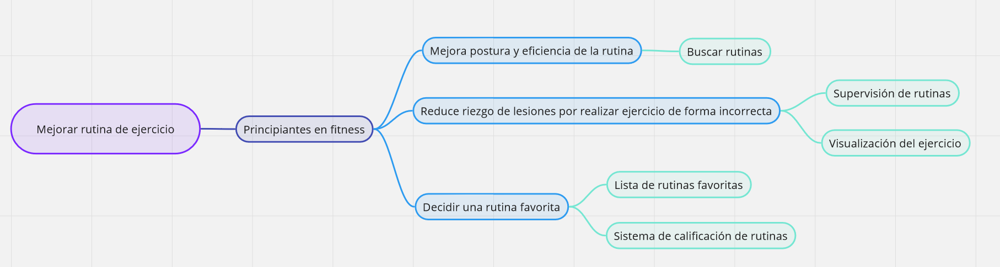

## **3.4. Product Backlog**

<table>
    <thead>
        <tr>
            <th>#Orden</th>
            <th>User Story ID</th>
            <th>Título</th>
            <th>Descripción</th>
            <th>Story Points (1/2/3/5/8)</th>
        </tr>
    </thead>
    <tbody>
        <tr>
            <td align="center">1</td>
            <td align="center">US01</td>
            <td>Buscar rutinas</td>
            <td>Como cliente quiero buscar rutinas de ejercicios para ejercitarte y mantenerte más saludable.</td>
            <td align="center">8</td>
        </tr>
        <tr>
            <td align="center">2</td>
            <td align="center">US04</td>
            <td>Activar supervisión de rutina</td>
            <td>Como cliente quiero activar la supervisión de mis rutas de ejercicio en vivo para que la aplicación pueda verificar su correcta ejecución.</td>
            <td align="center">8</td>
        </tr>
        <tr>
            <td align="center">3</td>
            <td align="center">US02</td>
            <td>Filtrar rutinas por duración</td>
            <td>Como cliente quiero filtrar rutinas de ejercicios según su duración para encontrar aquellas rutinas que se adecuen al tiempo que tengo disponible.</td>
            <td align="center">5</td>
        </tr>
        <tr>
            <td align="center">4</td>
            <td align="center">US03</td>
            <td>Filtrar rutinas por tipo</td>
            <td>Como cliente quiero filtrar las rutinas de ejercicio según su tipo para ejercitar solamente las partes del cuerpo que desee.</td>
            <td align="center">5</td>
        </tr>
        <tr>
            <td align="center">5</td>
            <td align="center">US08</td>
            <td>Visualizar un ejercicio</td>
            <td>Como cliente quiero visualizar un ejercicio en particular para estudiar los movimientos y secuencia de pasos.</td>
            <td align="center">5</td>
        </tr>
        <tr>
            <td align="center">6</td>
            <td align="center">US09</td>
            <td>Adquirir plan</td>
            <td>Como cliente quiero adquirir un plan para conseguir las funcionalidades premium de la aplicación.</td>
            <td align="center">3</td>
        </tr>
        <tr>
            <td align="center">7</td>
            <td align="center">US05</td>
            <td>Agregar rutina a favoritos</td>
            <td>Como cliente quiero agregar una rutina a favoritos para posteriormente acceder rápidamente.</td>
            <td align="center">2</td>
        </tr>
        <tr>
            <td align="center">8</td>
            <td align="center">US06</td>
            <td>Visualizar rutinas favoritas</td>
            <td>Como cliente quiero visualizar mis rutinas favoritas para encontrar y acceder rápidamente a la rutina que desee.</td>
            <td align="center">2</td>
        </tr>
        <tr>
            <td align="center">9</td>
            <td align="center">US07</td>
            <td>Calificar rutina de ejercicio</td>
            <td>Como cliente quiero calificar una rutina de ejercicio para dar una valoración a dicha rutina.</td>
            <td align="center">2</td>
        </tr>
    </tbody>
</table>

# **Capítulo IV: Strategic-Level Software Design**
## **4.1. Strategic-Level Attribute-Driven Design**
### **4.1.1. Design Purpose**

El propósito del sistema es crear una aplicación que permita proporcionar una solución efectiva y confiable para realizar los ejercicios dentro del gimnasio de manera correcta. Nuestra solución está diseñada para garantizar que los deportistas puedan realizar los ejercicios correspondientes de manera correcta para poder reducir la probabilidad de que estos contraigan diversas lesiones.

### **4.1.2. Attribute-Driven Design Inputs**

#### **4.1.2.1. Primary Functionality (Primary User Stories)**

Las historias de usuario más relevantes de nuestra solución de software son buscar rutinas y activar la supervisión de rutina de ejercicios, dado que ambas historias de usuario representan el core del negocio de nuestra startup.

<table>
    <thead>
        <tr>
            <th>User Story ID</th>
            <th>Título</th>
            <th>Descripción</th>
            <th>Criterios de aceptación</th>
        </tr>
    </thead>
    <tbody>
        <tr>
            <td align="center">US01</td>
            <td>Buscar rutinas</td>
            <td>Como cliente quiero buscar rutinas de ejercicios para ejercitarte y mantenerte más saludable</td>
            <td>Escenario 1: Búsqueda de rutinas
             Dado que me encuentro en la sección “Encontrar rutinas” cuando hago clic en la barra de búsqueda, escribe el nombre de la rutina de deseo y hago clic en el ícono de la lupa entonces el sistema muestra todos las rutinas que coincidan con lo especificado.
              Escenario 2: No se encontró ninguna rutina
             Dado que me encuentro en la barra de búsqueda de la sección “Encontrar rutina” cuando introduzco el nombre de una rutina que no coincida con ninguna rutina alojada en la aplicación y hago clic en el ícono de la lupa entonces el sistema muestra el mensaje “No se encontró ninguna rutina”.</td>
        </tr>
        <tr>
            <td align="center">US04</td>
            <td>Activar supervisión de rutina</td>
            <td>Como cliente quiero activar la supervisión de mis rutas de ejercicio en vivo para que la aplicación pueda verificar su correcta ejecución.</td>
            <td>Escenario 1: Supervisión activada
             Dado que me encuentro en la vista de una rutina cuando la cámara está habilitada y selecciono la opción “Supervisar rutina en vivo” entonces el sistema me redirige a una nueva ventana donde se supervisa en vivo las posturas que realizo en mi rutina de ejercicios.
              Escenario 2: Cámara inhabilitada
             Dado que me encuentro en la vista de una rutina cuando la cámara está inhabilitada y selecciono la opción “Supervisar rutina en vivo” entonces el sistema muestra un mensaje pidiendo que se otorgue a la aplicación los permisos de cámara.
              Escenario 3: Error en la ejecución de la rutina
             Dado que encuentro en la ventana “Supervisión en vivo de rutina” cuando el sistema detecta una postura incorrecta durante la rutina entonces muestra en pantalla una alerta y la postura en la que el usuario se equivocó.
            </td>
        </tr>
        <tr>
    </tbody>
</table>

#### **4.1.2.2. Quality attribute Scenarios**

| Atributo | Fuente | Estímulo | Artefacto | Entorno | Respuesta | Medida |
| -------- | ------ | -------- | --------- | ------- | --------- | ------ |
| Disponibilidad | Usuario | Correo electrónico ya registrado | Formulario de la página | Carga máxima | Tiempo en segundos que el sistema demora en detectar si un correo electrónico ya se encuentra registrado | 1-2 segundos |
| Rendimiento | Usuario | Búsqueda de rutinas | Buscador de la página | Carga moderada | Tiempo en segundos que el sistema demora en mostrar la lista de las rutinas que coincidan con lo especificado. | 2 segundos |
| Rendimiento | Usuario | Búsqueda de rutinas con filtros | Buscador de la página | Carga máxima | Tiempo en segundos que el sistema demora en mostrar la lista de las rutinas que coincidan con lo especificado. | 4-5 segundos |
| Rendimiento | Usuario | Postura incorrecta del usuario que no coincida con el ejercicio de la rutina que está realizando en ese momento | Supervisión de rutina mediante visión artificial y deep learning | Carga máxima | Tiempo en segundos que el sistema demora en detectar una postura incorrecta en la rutina del usuario. | 2-3 segundos |
| Rendimiento  | Usuario | Clic en el botón para mostrar las rutinas favoritas | Botón que redirecciona a la página de rutinas favoritas | Carga máxima | Tiempo en segundos que el sistema demora en listar todas las rutinas favoritas | 2-3 segundos |
| Rendimiento | Usuario | Clic en el botón con forma de corazón | Botón de la página | Carga moderada | Tiempo en segundos para almacenar una rutina en la lista de favoritos | 1 segundo |
| Rendimiento | Usuario | Calificación otorgada a una rutina por el usuario | Íconos de estrellas que representan la calificación en la página | Carga moderada | Tiempo en segundos que el sistema demora en mostrar la nueva calificación promedio. | 1 segundo |

#### **4.1.2.3. Constraints**

| Technical Story ID | Título | Descripción |
| ------------------ | ------ | ----------- |
| TS01 | Aplicación móvil en Android y iOS | Como desarrollador quiero que la aplicación móvil sea accedida desde un dispositivo Android y iOS para que los usuarios puedan usarla sin preocuparse del sistema operativo que usan. |
| TS02 | Aplicación móvil utiliza software de código abierto | Como desarrollador quiero que las tecnologías utilizadas para el desarrollo de la aplicación móvil sea software de código abierto (open source) para que el costo sea el mínimo posible. |
| TS03 | Base de datos no relacional | Como desarrollador quiero que la base de datos utilizada para la aplicación móvil sea no relacional para aprovechar su funcionalidad. |
| TS04 | Aplicación móvil utiliza MediaPipe | Como desarrollador quiero que la aplicación móvil utilice MediaPipe para reconocer la postura del usuario. |
| TS05 | Soporte de usuarios que acceden simultáneamente | Como desarrollador quiero que la aplicación móvil pueda soportar como mínimo 100 usuarios simultáneamente para garantizar el correcto funcionamiento cuando la aplicación sea desplegada. |
| TS06 | Medio de pagos | Como desarrollador quiero que la aplicación móvil utilice los medios de pagos más utilizados (Débito y crédito) para que los usuarios puedan utilizar la forma de pago que prefieran. |
| TS07 | Renovación de suscripción automática | Como desarrollador quiero que la suscripción pueda ser renovada automáticamente, a menos que el usuario decida cancelarla antes que termine su suscripción actual, para que pueda utilizar la aplicación sin interrupciones y preocupaciones. |

### **4.1.3. Architectural Drivers Backlog**

Después de haber recolectado inputs, los clasificamos para que nos permita entender el impacto que generan al momento del desarrollo en nuestra arquitectura, en base a esto, podremos desarrollar los Architectural Drivers.

Como nomenclatura para los inputs usaremos los siguientes:
H: Importancia / impacto (alto)
M: Importancia / impacto (medio)
B: Importancia / impacto (bajo)

Además, hemos colocado el orden de los drivers en base a la importancia / impacto.

<table>
    <thead>
        <tr>
            <th rowspan=2>Driver ID</th>
            <th rowspan=2>Título del Driver</th>
            <th rowspan=2>Descripción</th>
            <th rowspan=2>Importancia para Stakeholders</th>
            <th rowspan=2>Impacto en Arquitectura Technical Complexity</th>
        </tr>
    </thead>
    <tbody>
        <tr>
            <td>D-1</td>
            <td align="center">Buscar rutinas</td>
            <td align="center">Como cliente quiero buscar rutinas de ejercicios para ejercitarte y mantenerte más saludable.</td>
            <td align="center">H</td>
            <td align="center">H</td>
        </tr>
        <tr>
            <td>D-2</td>
            <td align="center">Activar supervisión de rutina</td>
            <td align="center">Como cliente quiero activar la supervisión de mis rutas de ejercicio en vivo para que la aplicación pueda verificar su correcta ejecución.</td>
            <td align="center">H</td>
            <td align="center">H</td>
        </tr>
    </tbody>
</table>

### **4.1.4. Architectural Design Decisions**

En esta primera entrega del proyecto, contábamos como equipo con una arquitectura basada en el desarrollo de manera monolítica la cual no contaba con una integración de servicios externos. Por ende, luego de haber identificado los inputs que nos sirven para el desarrollo de los drivers, decidimos el cambio de arquitectura para implementar estrategias que nos permitan implementar los drivers mencionados.

La finalidad de este cambio es la implementación de la aplicación web y el landing page y en un futuro, el app móvil integrándose con servicios externos, ya que, la complejidad en el desarrollo es el motivo por el cual decidimos el cambio.

### **4.1.5. Quality Attribute Scenario Refinements**

## **4.2. Strategic-Level Domain-Driven Design**
### **4.2.1. EventStorming**

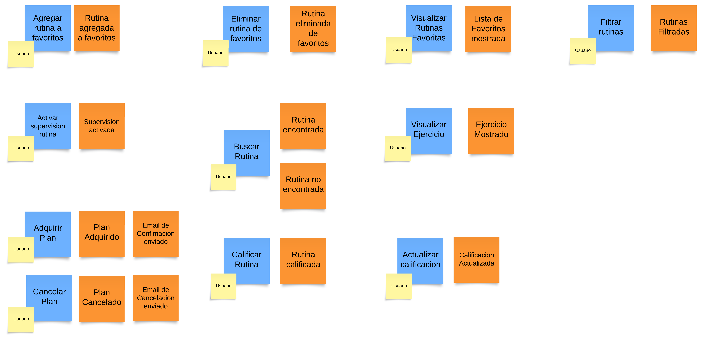

### **4.2.2. Candidate Context Discovery**

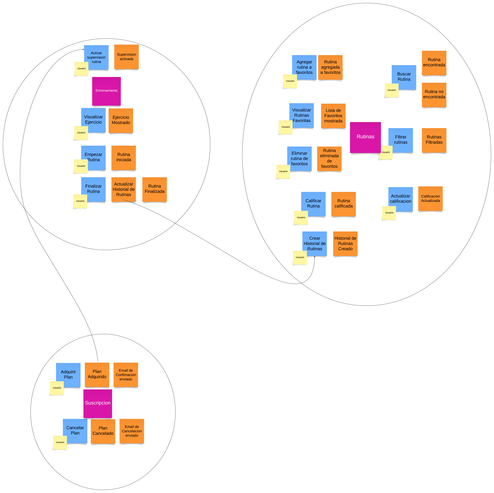

### **4.2.3. Domain Message Flows Modeling**

Presentamos los Message Flows Modelling para los dominios con alto valor en nuestro negocio, además, utilizamos el Separate Message and Contents para el diagrama del flujo de los diagramas.

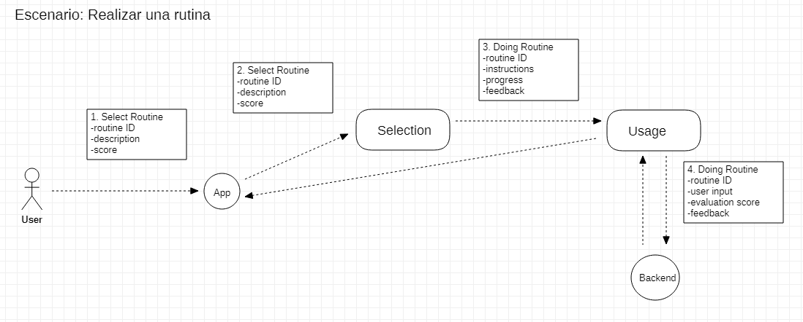

### **4.2.4. Bounded Context Canvases**
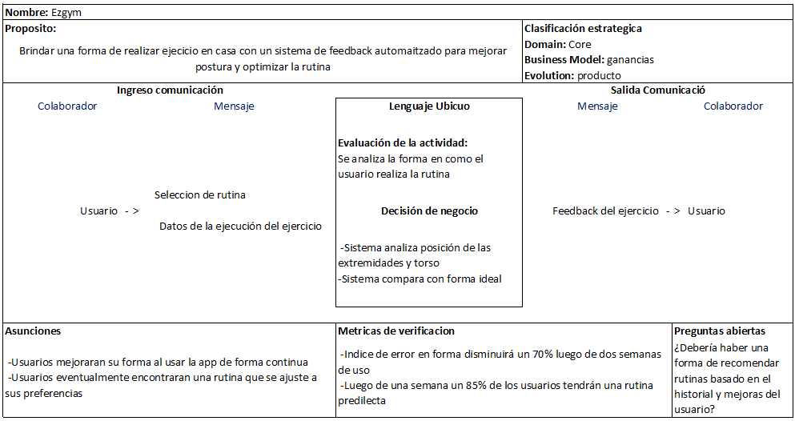

### **4.2.5. Context Mapping**

Para el context mapping colocamos algunos bounded context definidos previamente. Nos hemos dado cuenta que existen diversas relaciones.

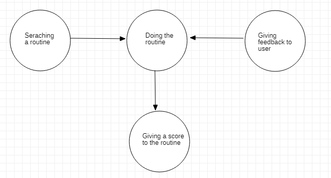

## **4.3. Software Architecture**
### **4.3.1. Software Architecture System Landscape Diagram**
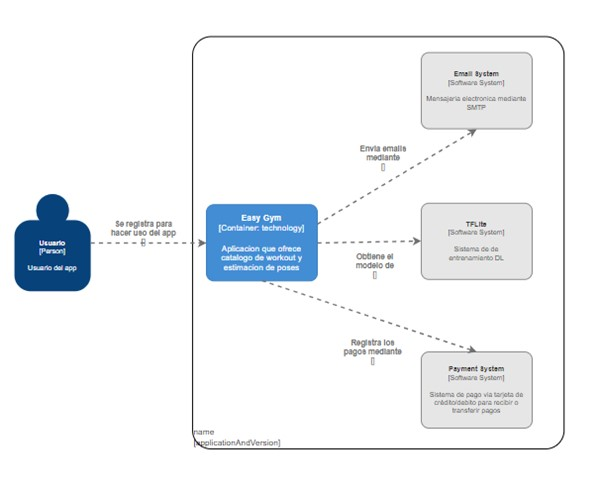

### **4.3.1. Software Architecture Context Level Diagrams**
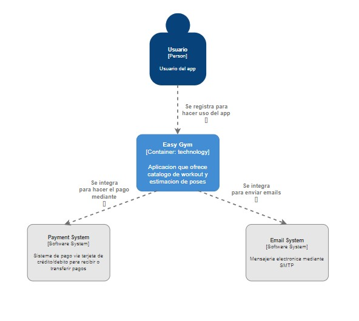

### **4.3.2. Software Architecture Container Level Diagrams**
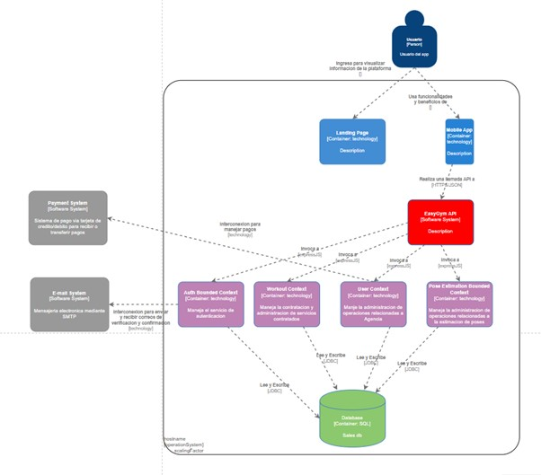

### **4.3.3. Software Architecture Deployment Diagrams**

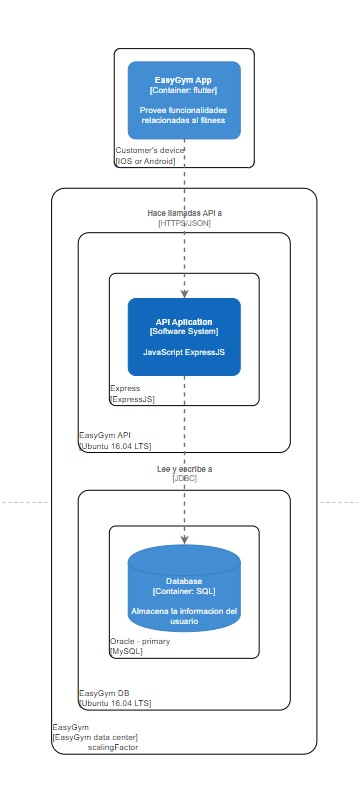
