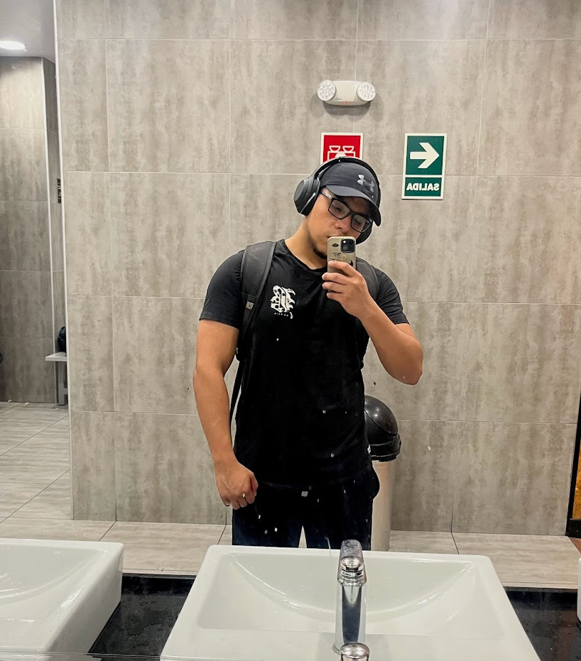

# **Capítulo I: Introducción**
## **1.1. Startup Profile**
### **1.1.1. Descripción de la Startup**

Los Arquitectos es una startup de desarrollo de software que otorga, mediante el uso de deep learning, la facilidad de que nuevas personas puedan adentrarse al mundo fitness teniendo la seguridad de que la aplicación los ayudará a supervisar en vivo sus rutinas de ejercicio.

**Misión**

Facilitar rutinas de ejercicios a personas que comienzan a adentrarse al mundo fitness y supervisar sus rutinas de ejercicios mediante el uso de visión artificial y deep learning.

**Visión**

Ser una startup reconocida a nivel nacional y la primera opción de nuevos personas que ingresan por primera vez al mundo fitness.

### **1.1.2. Perfiles de integrantes del equipo**

**Nombre:** Vanessa Irene Flores Ñahuis

**Carrera:** Ingeniería de software

**Descripción:** Soy estudiante de la carrera de ingeniería de software en la Universidad Peruana de Ciencias Aplicadas. Me considero una persona dispuesta a aprender nuevas habilidades y aportaré al equipo y al desarrollo del trabajo con los conocimientos que he adquirido en cursos previos y los conocimientos que adquiriré en este curso.

**Nombre:** Adrian Fernando Liviapoma Mendez

**Carrera:** Ingeniería de software

**Descripción:** Soy estudiante de la carrera de Ingeniería de Software, considero que este proyecto me ayudara a desenvolverme como mejor profesional en el ámbito laboral y a mejorar los conocimientos previos.

## **1.2. Solution Profile**
### **1.2.1 Antecedentes y problemática**

### **1.2.2 Lean UX Process**

#### **1.2.2.1. Lean UX Problem Statements**

Nuestro servicio busca cubrir la necesidad de las personas nuevas en el mundo del fitness, en términos de rutinas y su correcta ejecución, al proporcionar una solución integral y personalizada. Comprendemos que el ingreso al gimnasio puede ser abrumador y desafiante para aquellos sin experiencia previa. Por lo tanto, hemos diseñado un enfoque que no solo se centra en proporcionar rutinas de ejercicio efectivas, sino que también aborda la preocupación fundamental de cómo realizar los movimientos de manera segura y eficiente.
Por lo que. ¿Cómo podemos ayudar a los principiantes a ejecutar los ejercicios y a la vez resguardar su seguridad?

#### **1.2.2.2. Lean UX Assumptions**

- Nuestros clientes necesitan una aplicación que les permita verificar la correcta ejecución de las rutinas que realizan para reducir la probabilidad de lesiones y mejorar su rendimiento en el gimnasio.
- Tenemos un público objetivo: Aquella persona que viene iniciando en el gimnasio 
- La propuesta por el grupo cuenta con una aplicación interactiva e intuitiva la cual brindara el feedback necesario para que el usuario pueda realizar la correcta ejecución de los ejercicios.

**Business Outcomes**
- Mejora la calidad del ejercicio realizado
- Reduce el dolor muscular
- Reduce la probabilidad de lesiones
- Mejora el rendimiento de los usuarios en el gimnasio 

**Users**
- User Principal: Persona que inicia en el mundo del fitness y realiza ejercicios en el gimnasio

**User Outcomes**
- Los usuarios mejoran su rendimiento en el gimnasio gracias a los consejos brindados por la aplicación. 
- Los usuarios no tendrán problemas al utilizar la aplicación ya que esta será sencilla e intuitiva de utilizar.
- Los usuarios reducirán la probabilidad de contraer lesiones gracias a las guías brindadas por la aplicación. 

**Features**
- Función que permitirá seleccionar una de las rutinas predeterminadas de la aplicación
- Función que te brindara guías para la correcta ejecución de los ejercicios
- Función que te notificara en caso no estes realizando los ejercicios de manera correcta

#### **1.2.2.3. Lean UX Hypothesis Statements**

**Hypothesis: (1)**

*Creemos que*
Al brindar una aplicación que permita brindar acompañamiento y consejos durante la ejecución de los ejercicios para que estos puedan ser realizados de manera correcta, los usuarios mejoran su rendimiento en el gimnasio. 

*Sabremos que hemos tenido éxito*
Cuando aumente la cantidad de usuarios que utilicen la aplicación.

**Hypothesis: (2)**

*Creemos que*
Al ofrecer notificaciones cuando los usuarios no realicen los ejercicios de manera correcta, reduciremos la probabilidad de que estos puedan llegar a lesionarse.

*Sabremos que hemos tenido éxito*
Cuando las reseñas de nuestros usuarios sean en su mayoría extremadamente positivas.

#### **1.2.2.4. Lean UX Canvas**

## **1.3. Segmentos objetivo**

Los usuarios de nuestra aplicación están conformados por un tipo de perfil. a continuacion se dara detalle:

- **Cliente nuevo:** Persona mayor de 18 años que recién está adentrándose al mundo fitness y tiene la necesidad de que supervisen sus rutinas de ejercicio.

# **Capítulo II: Requirements Elicitation & Analysis**
## **2.1. Competidores**

Para el desarrollo de este proyecto consideramos 3 posibles competidores de los cuales  los dos primeros son cadenas de gimnasios bastante conocidas en Perú (SmartFit y BodyTech) y el último es una aplicación móvil bastante usada por deportistas que acuden al gimnasio la cual brinda apoyo para trackear los respectivos entrenamientos.

### **2.1.1. Análisis competitivo**

### **2.1.2. Estrategias y tácticas frente a competidores**

## **2.2. Entrevistas**
### **2.2.1. Diseño de entrevistas**

### **2.2.2. Registro de entrevistas**

### **2.2.3. Análisis de entrevistas**

## **2.3. Needfinding**
### **2.3.1. User Personas**

### **2.3.2. User Task Matrix**

### **2.3.3. Empathy Mapping**

### **2.3.4. As-is Scenario Mapping**

# **Capítulo III: Requirements Specification**
## **3.1. To-Be Scenario Mapping**

## **3.2. User Stories**

## **3.3. Impact Mapping**

## **3.4. Product Backlog**

# **Capítulo IV: Strategic-Level Software Design**
## **4.1. Strategic-Level Attribute-Driven Design**
### **4.1.1. Design Purpose**

El propósito del sistema es crear una aplicación que permita proporcionar una solución efectiva y confiable para realizar los ejercicios dentro del gimnasio de manera correcta. Nuestra solución está diseñada para garantizar que los deportistas puedan realizar los ejercicios correspondientes de manera correcta para poder reducir la probabilidad de que estos contraigan diversas lesiones.

### **4.1.2. Attribute-Driven Design Inputs**

#### **4.1.2.1. Primary Functionality (Primary User Stories)**

#### **4.1.2.2. Quality attribute Scenarios**

#### **4.1.2.3. Constraints**

### **4.1.3. Architectural Drivers Backlog**

### **4.1.4. Architectural Design Decisions**

### **4.1.5. Quality Attribute Scenario Refinements**

## **4.2. Strategic-Level Domain-Driven Design**
### **4.2.1. EventStorming**

### **4.2.2. Candidate Context Discovery**

### **4.2.3. Domain Message Flows Modeling**

### **4.2.4. Bounded Context Canvases**

### **4.2.5. Context Mapping**

## **4.3. Software Architecture**
### **4.3.1. Software Architecture System Landscape Diagram**

### **4.3.1. Software Architecture Context Level Diagrams**

### **4.3.2. Software Architecture Container Level Diagrams**

### **4.3.3. Software Architecture Deployment Diagrams**